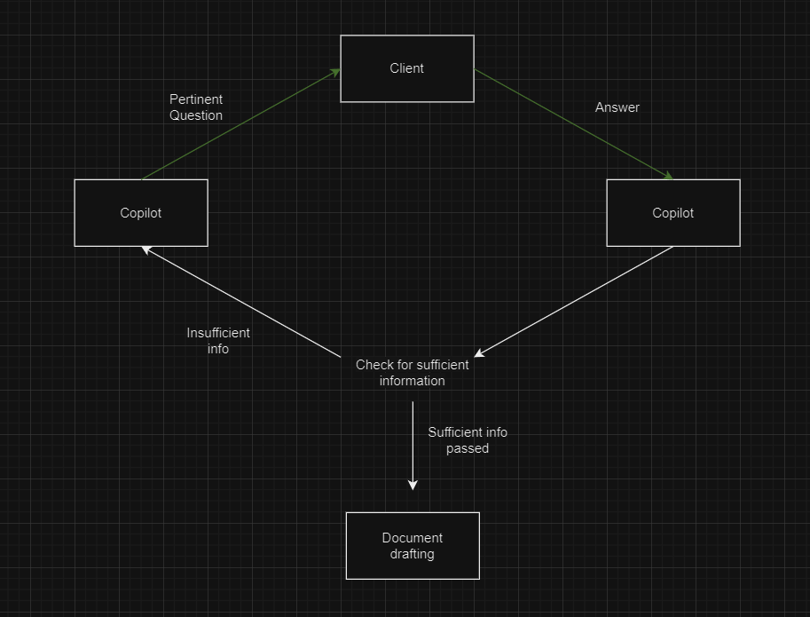
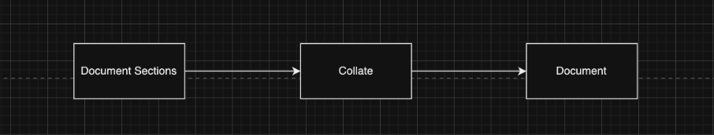

# MoM - 16th and 17th April

Minutes of Meeting on the discussion over tickets and work flow.

## Building Qs (Ticket no. 2):

- Providing Document’s sections and semantics as “Context” in our few shot prompt
- Giving examples of few questions for a section in the few shot prompts such as:
Prompt: For every paragraph given below build 5 questions each that can cover all the details and keywords of that particular paragraph. The questions made should not be similar for a particular para and tone of the question should be natural.
Example 1: "{A Document section}" 
{Few Questions related to it}
Example 2: "{Another Document section}" 
{Few Questions related to it}
-   In this way the LLM will generate enough questions pairs on a every document section provided.

-   We can also set no. of questions, the tone of questions, length and other requirements. 

## Building the interface + copilot response cycle (Ticket no. 4):

-   Rounds of question and answer session with client will occur.
    
- If sufficient info is not recieved then copilot will again ask a better question to get all the details needed.
- After recieving all the info then the document drafting process will begin.

## Drafting the document (Ticket no. 5):

-   Here we will merge the pertinent document sections.
    
-   The merging will occur in a defined layout or structure according to the need.
    
-   This will result in our final draft of the required document.
    

